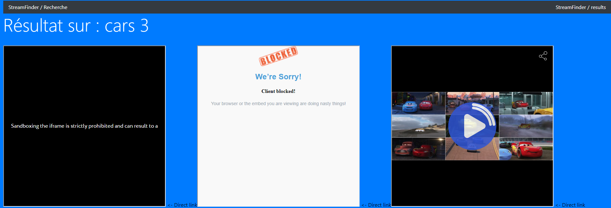
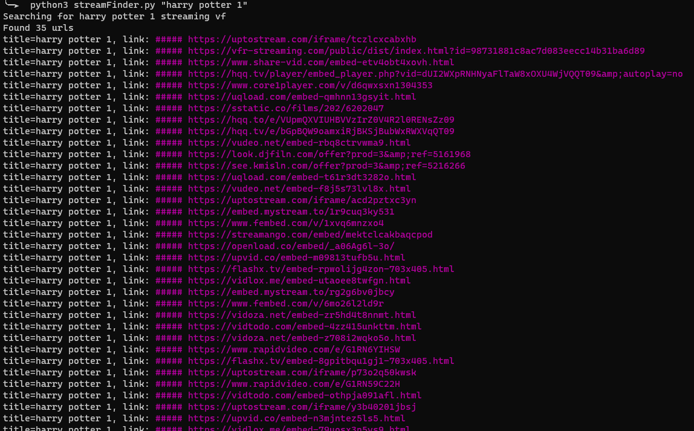

# streamFinder
a tool to find streaming URLS based on movie title

This will look for google and duckduckgo links, try to go on streaming websites for you, and return direct streaming urls, without shitty ads from streaming websites.

# /!\

I don't own the movies nor the url hostsing or anything. I'm just googling stuff for you.

Use this tool at your own risks, i'm not responsible if you contribute to the fall of streaming platforms.

# Web results

To each search made through the tool, an unique ID is associated. Use this ID to go back to the results at any time !

How to use this id ?
-> /iframes?id=<id>
-> /results?id=<id>

# sources selector

## Options available

full: GDE
- G = Google search
- D = Duckduckgo search
- E = External -> defined by you&me (see below)

## External:
Create a .py in the sources/plugin file (you can use xitof.py as a reference)

define a class with the name "Movie"

define a function inside called "get_movie(title: str) -> set"

Do whatever needed to find and extract the url of a movie

this function should return a set or links that will be printed to the user.

Currently implemented: xitof/OKVOP or what ever the name is today

# usage

CLI:
```
virtualenv -p python3.9 .py3
source .py3/bin/activate
python3 -m pip install -r requirements.txt

python3 streamFinder.py "Harry Potter 1"
```

Web setup:
```
cd /var/www/html/
git clone <git url>
virtualenv -p python3.9 .py3
source .py3/bin/activate
python3 -m pip install -r requirements.txt

cd web
uwsgi --http :80 --wsgi-file streamFinder_web.wsgi
```
Modify username and password in the file /var/www/html/streamFinder/web/modules/streamFinder_web.py
Default is admin:secret

# Web preview
## Search page:


## Result example


## iframes loading example



# Command line example


