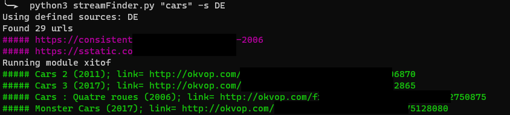

# streamFinder
A tool to find streaming URLS based on movie title.

This will look for Google and Duckduckgo links, try to go on streaming websites for you, and return direct streaming urls, without shitty ads from streaming websites.

# /!\

I don't own the movies nor the url hostsing or anything. I'm just googling stuff for you.

Use this tool at your own risks, i'm not responsible if you contribute to the fall of streaming platforms.

# Web results

To each search made through the tool, an unique ID is associated. Use this ID to go back to the results at any time !

How to use this id ?
- /iframes?id=__id__
- /results?id=__id__

# Sources selector
## Options available

full: GDE
- G = Google search
- D = Duckduckgo search
- E = External -> defined by you&me (see below)

## External:
1. Create a .py in the sources/plugin file (you can use xitof.py as a reference).
2. Define a class with the name "Movie".
3. Define a function inside called "get_movie(title: str) -> set".
4. Do whatever needed to find and extract the url of a movie.
5. This function should return a set or links that will be printed to the user.

Currently implemented: xitof/OKVOP or what ever the name is today.

# Tool setup
## CLI
In the steps below, we assume that the user `user` is used and is sudoer, and that use are using a clean fresh Ubuntu 20.04 distro. Install the needed packages.
```
sudo apt install python3-virtualenv build-essential libpython3-dev -y
```
`git clone` the project and set the correct permissions.
```
cd /srv/
sudo git clone https://github.com/ElSicarius/streamFinder.git
sudo chown user:user /srv/streamFinder -R
```
Create a venv and use it.
```
cd /srv/streamFinder/
virtualenv -p python3 /srv/streamFinder/.py3
source  /srv/streamFinder/.py3/bin/activate
```
Install the required modules (if a module fails to install, fix the problem and run the command again).
```
python3 -m pip install -r requirements.txt
```
Then, try to run the tool.
```
python3 streamFinder.py "Harry Potter 1"
```

## Web interface
We assume you followed the setup steps above. Now, you can run the web interface by running the commands below.
```
cd /srv/streamFinder/web/
uwsgi --http :8080 --wsgi-file streamFinder_web.wsgi
```
Modify username and password in the file `/var/www/html/streamFinder/web/modules/streamFinder_web.py`. Default is `admin`:`secret`.

# Web preview
## Search page:


## Result example


## iframes loading example


# Command line example



# Issues
- You may encounter issues while running this tool or installing the `pip` packages (i.e. the tool not working at all) if your are using a VPN (blacklisted IP) or a proxy. If so, try to disable them and to run the tool again.
- If you get a Python error while running the tool, check that all the required packages are correctly installed.